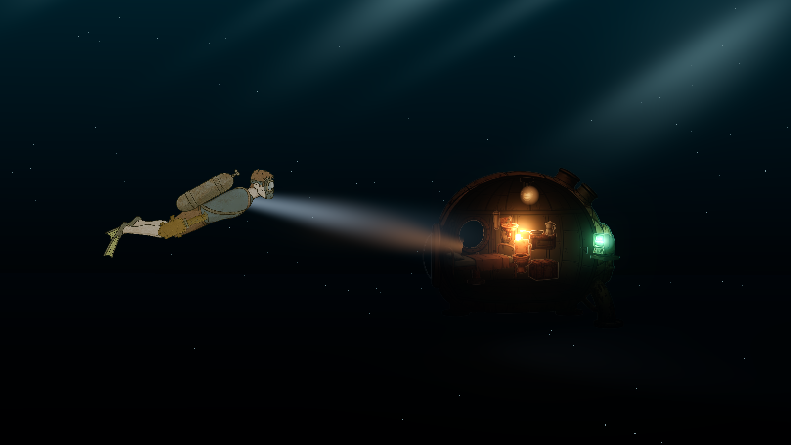

# Rusted Sea: Refurberators

The Rusted Retaliators fight the war. You're a **Refurberator** — the salvage
corps that goes in after.

A web-first reboot of [Rusted Sea](https://github.com/Meerkatapult-Games/Rusted-Sea),
rebuilt in three.js: original Spine 4.2 rigs and art, new engine, new lighting,
reworked core loop around salvage, exploration, and darkness.

## Status

**Milestone 0 — the lighting proof.** The furnished SHELLTER interior glowing
in dark water; the diver (original Spine rig) swimming home under a flashlight
beam. Volumetric god rays, drifting particulate, bloom.



## Stack

- Vite + TypeScript
- three.js (2.5D: 2D Spine characters and props in lit 3D water)
- `@esotericsoftware/spine-threejs` **4.2.x** — must match the Spine 4.2.43
  skeleton exports; do not bump to 4.3+ without re-exporting rigs
- Physics (from Milestone 1): Rapier2D

## Dev

```sh
npm install
npm run dev            # http://localhost:5199 (or vite's default port)
node scripts/shot.mjs out.png   # headless screenshot of the running scene
```

## 3D sub prototype

`/sub.html` — pilotable 3D submarine in void water (the sub-centric 3D
direction under evaluation). W/S thrust, A/D turn, R/F depth, drag to look.
A wrecked Sea Major lies ~55m ahead in the fog; fly to it. Debug camera:
`?yaw=<rad>&pitch=<rad>`.

## Milestones

- [x] **M0** — lighting proof: Spine pipeline + relit original art
- [ ] **M1** — loop slice: input layer, diver movement (Rapier2D), destructible
      wall, salvage, FROG oxygen hops, return to SHELLTER
- [ ] **M2** — weekly playtest cadence: shareable web build
